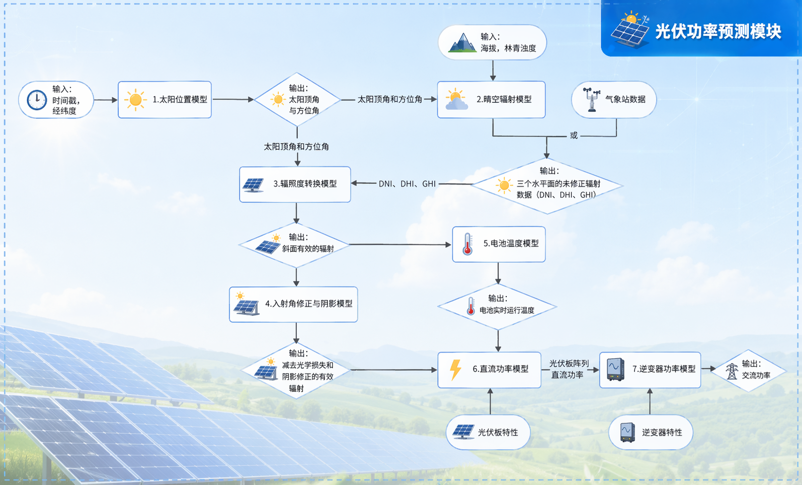

# 零碳园区能源系统 (SolarStorageAdvisor)

**项目目标**：结合用户特点，提供光伏发电和储能成本可行性分析，为用户提供"零碳园区"的建设依据。

**关键词**：光伏发电能力、风力发电、储能、负荷曲线、峰谷电价套利、碳证交易、优化算法

---

## 项目流程

本项目采用三阶段流程实现零碳园区的能源管理与优化：

### 阶段一：新能源出力计算
使用专业物理模型计算园区的新能源发电能力

| 模块 | 技术 | 说明 |
|------|------|------|
| 光伏发电 | pvlib | 支持晴天/多云/阴天/雨天/雾天等多种天气类型 |
| 风力发电 | windpowerlib | ModelChain功率曲线计算 |
| 负荷预测 | 统计分析 | 工业/商业/居民负荷 |

**光伏计算流程图：**



### 阶段二：优化控制策略
使用 MATLAB 实现的高级优化算法

| 算法 | 说明 |
|------|------|
| 集中式优化 | 全局最优控制策略 |
| ADMM分散式优化 | 分布式协同优化 |
| 储能控制 | 考虑充放电效率和老化的储能策略 |
| 碳交易 | 碳排放核算与碳证交易 |

**支持200+个日场景的优化分析**

### 阶段三：可视化平台
基于 Flask 的 Web 可视化系统

- 功率曲线图：园区总功率曲线、分园区功率曲线
- 设备配置：光伏板配置、储能配置、风机配置
- 优化结果：不同场景下的优化效果对比
- 经济性分析：成本收益计算

**可视化平台截图：**


---

## 项目结构

```
SolarStorageAdvisor/
├── Solar/                      # 光伏计算模块
│   ├── Solar.py               # pvlib光伏功率计算
│   ├── Solar_auto.py          # 自动光伏配置
│   └── pvlib_guide.md         # pvlib使用指南
│
├── Wind/                       # 风电计算模块
│   ├── Wind.py                # windpowerlib风力发电计算
│   ├── modelchain_example.py  # ModelChain使用示例
│   └── weather.csv            # 气象数据
│
├── Consumption/               # 负荷计算模块
│   ├── Consumption.py         # 基础负荷
│   └── IndustrialConsumption.py # 工业负荷
│
├── Storage/                    # 储能模拟模块
│   └── Storage.py             # 储能充放电模拟
│
├── web/                       # Web可视化平台
│   ├── app.py                # Flask应用
│   ├── templates/
│   │   └── index.html        # 前端页面
│   └── static/
│       ├── css/style.css     # 样式文件
│       └── js/app.js         # 前端脚本
│
├── 零碳园区优化_v8/           # MATLAB优化算法
│   ├── build_case.m         # 构建优化问题
│   ├── solve_centralized.m  # 集中式求解器
│   ├── solve_admm_fixed.m   # ADMM分散式求解器
│   ├── carbon_accounting.m  # 碳排放核算
│   ├── comparison_metric_table.csv # 对比指标表
│   └── 1-Day Scenarios/      # 日场景数据(200个)
│
├── config/                    # 配置文件
│   ├── config_manager.py     # 配置管理
│   └── Storage/configs/      # 储能配置
│
└── main.py                   # 主程序入口
```

---

## 技术栈

### 后端
- **Python 3.x**：核心计算语言
- **pvlib**：光伏系统仿真
- **windpowerlib**：风力发电仿真
- **Flask**：Web框架
- **MATLAB**：优化算法实现

### 前端
- **HTML5**：页面结构
- **CSS3**：样式设计
- **JavaScript**：交互逻辑
- **Plotly**：数据可视化

### 优化算法
- **MATLAB**：优化问题建模与求解
- **ADMM**：交替方向乘子法
- **集中式/分散式**：两种优化架构

---

## 快速开始

### 1. 安装依赖

```bash
pip install pvlib windpowerlib flask pandas numpy matplotlib
```

### 2. 运行新能源计算

```python
from Solar.Solar import getsolar
from Wind.Wind import getwind

# 计算光伏出力
solar = getsolar(community="community1", start="2010-06-01", end="2010-06-02")

# 计算风电出力
wind = getwind(start="2010-06-01", end="2010-06-01", community="community1")
```

### 3. 启动Web服务

```bash
cd web
python app.py
```

然后在浏览器中访问 `http://localhost:5000`

---

## 功能特点

1. **多能源互补**：光伏+风电+储能的多能互补系统
2. **多场景分析**：支持200+个典型日场景的优化分析
3. **灵活配置**：支持光伏板、储能、风机的多种配置方案
4. **经济性优化**：考虑电价套利、碳交易等经济因素
5. **可视化展示**：直观的图表展示和交互界面

---

## 计算板块

1. **负荷曲线**：日/年负荷曲线，置信区间
2. **光伏出力**：一次成本、可变成本、波动性、老化
3. **储能**：一次成本、可变成本、充放电效率、老化
4. **生命周期成本及碳证书成本**：运营维护、碳证价格

最终结合工业电价计算总成本，目标是使得成本最低（回本周期最短），从而实现提供"零碳园区"的建设依据。

---

## 后续改进方向

### 1. 日收益计算模块
- 实现每日收益的精确计算
- 区分峰谷电价收益
- 考虑余电上网收益

### 2. 投资回报分析
- **设备一次投资成本**：
  - 光伏组件投资成本
  - 风力发电机投资成本
  - 储能系统投资成本
  - 配套设施投资成本

- **折旧成本计算**：
  - 光伏组件25年折旧
  - 风机20年折旧
  - 储能系统10年折旧

- **回报率分析**：
  - 内部收益率(IRR)
  - 净现值(NPV)
  - 投资回报率(ROI)

- **回本周期计算**：
  - 静态回本周期
  - 动态回本周期（考虑资金时间价值）

### 3. 经济性优化目标扩展
```
目标函数 = min(年化总成本 - 年化新能源收益 - 年化碳证收益 - 年化补贴)

约束条件：
- 功率平衡约束
- 储能SOC约束
- 设备容量约束
- 电网接入约束
```

---

## 许可证

MIT License
